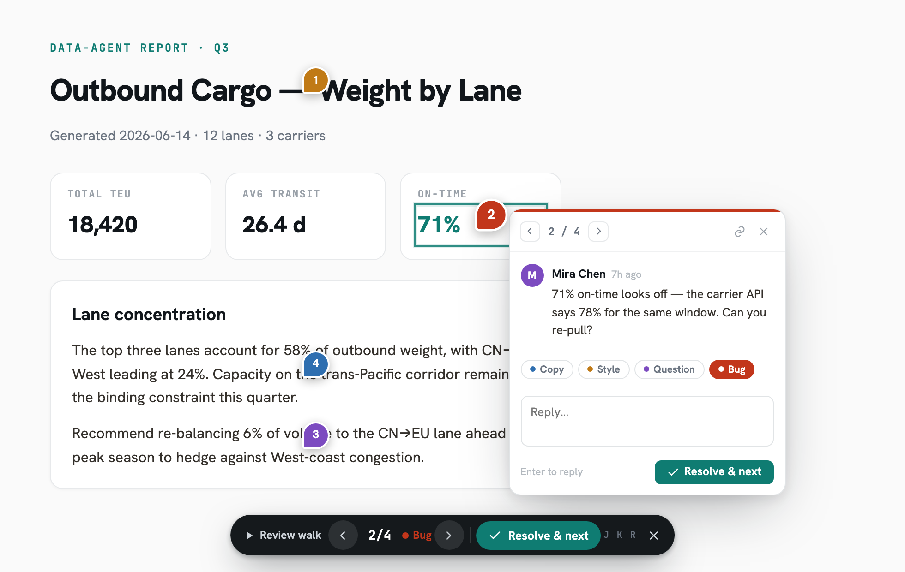

[English](README.md) · [简体中文](README.zh-CN.md)

# pagepin

自托管的静态页面托管服务，支持元素级打点评论与 AI 反馈闭环 —— **让 agent 真正能拉取到的反馈**。

用一条 `curl` 部署任意 HTML 报告或静态站点，分享链接，评审者即可直接在页面元素上打点评论。每条评论都带有 CSS selector、类型（`copy` / `style` / `question` / `bug`）和已解决标记 —— 你的编码 agent 因此能以结构化 JSON 拉取未解决的反馈，修改页面后再发布。评审闭环就此闭合，无需再往聊天里贴截图。

## 功能特性

- **一条命令部署** —— multipart `POST /api/sites/{slug}/deploy`；对同一 slug 重新部署即发布一个新的原子版本。
- **版本化发布** —— 每个站点保留完整版本历史，一次调用即可回滚。
- **元素级打点评论** —— 一个轻量 overlay（`comments.js`）被注入到所服务的 HTML 中；登录的访客可在元素上打点、在线程中回复并将线程标记为已解决。
- **为 AI agent 而生** —— `GET /api/sites/{slug}/comments` 返回每个线程的 `selector`、`kind`、页面路径、深链 URL 和锚点失效信息；实时 API 指南托管在 `/skill.md`，可直接贴进 agent 上下文。
- **默认私有** —— 查看需要登录；站点可在限定时间窗内公开（默认上限 7 天），到期自动回落为私有。
- **Markdown 与图片查看器壳** —— `.md` 文件和图片会获得一个可读的查看器页面（追加 `?raw` 取原始文件）。
- **SPA 兜底** —— 可按站点开启，适配客户端路由应用。
- **可插拔认证** —— 内置邮箱/密码（可选开放注册）、Google/GitHub 社交登录、任意 OIDC provider，或 `none`（本地开发）。
- **可插拔存储** —— 本地文件系统或任意 S3 兼容对象存储（MinIO、R2 等）。
- **占用小** —— 一个 Node 进程 + SQLite；单个 Docker 镜像，内含 React 控制台。
- **单域或双域服务** —— 全部跑在一个 origin 上，或把托管内容隔离到独立的内容域（见[架构](#架构)）。

## 快速开始

### Docker

```bash
docker run -d --name pagepin \
  -p 8000:8000 \
  -v pagepin-data:/data \
  -e PAGEPIN_ADMIN_EMAIL=admin@example.com \
  -e PAGEPIN_ADMIN_PASSWORD=change-me-please \
  ghcr.io/pagepin/pagepin:0.2.1
```

打开 `http://localhost:8000`，用管理员身份登录，设置一个 handle，并在控制台创建一个 API token（`pp_...`）。仓库中附带了 `docker-compose.yml`（含可选的 MinIO 配置块）。

### 从源码运行

```bash
pnpm install
pnpm -C console install && pnpm -C console build   # 可选：构建 Web 控制台
pnpm dev                                           # API 跑在 http://localhost:8000
```

### Agent skill（面向 AI 编码工具）

把部署与评审闭环教给你的编码 agent。装一次，所有项目、所有会话都能用；通过浏览器登录（设备授权），token 不进聊天：

```bash
npx skills add pagepin/pagepin -g
```

Claude Code 也可作为插件安装：

```text
/plugin marketplace add pagepin/pagepin
/plugin install pagepin@pagepin
```

完整选项（CI/脚本化安装、支持的 agent）见 [`install.md`](install.md)。没有本地 skill 目录的 agent，可改为指向实时托管的 **`/skill.md`**。

## 配置

所有配置均通过环境变量完成。

| 变量 | 默认值 | 说明 |
|---|---|---|
| `PAGEPIN_PORT` | `8000` | HTTP 监听端口。 |
| `PAGEPIN_DATA_DIR` | `./data` | 数据根目录：SQLite 数据库、生成的 secret 以及 `fs` 存储。 |
| `PAGEPIN_BASE_URL` | `http://localhost:8000` | 实例的公开 URL（单域模式）。 |
| `PAGEPIN_CONSOLE_HOST` | — | 控制台主机名。**同时**设置两个 host 变量即切换到双域模式。 |
| `PAGEPIN_CONTENT_HOST` | — | 内容（托管页面）主机名。 |
| `PAGEPIN_EXTERNAL_SCHEME` | `https` | 双域模式下构建外部 URL 所用的 scheme。 |
| `PAGEPIN_AUTH_MODE` | `password` | `password`、`oidc` 或 `none`（仅开发：自动以管理员身份登录）。 |
| `PAGEPIN_REGISTRATION_MODE` | — | `open` / `invite` / `closed`。设置后即在控制台 UI 锁定注册模式；不设时由控制台（DB）设置决定，并以 `PAGEPIN_ALLOW_SIGNUP` 兜底。 |
| `PAGEPIN_ALLOW_SIGNUP` | `true` | 自助注册的兜底默认（password 模式），仅当既无 `PAGEPIN_REGISTRATION_MODE` 也无控制台设置时生效；不再锁定 UI。 |
| `PAGEPIN_ADMIN_EMAIL` | — | 若与密码一并设置，启动时 upsert 一个管理员用户。否则首个注册者成为管理员。 |
| `PAGEPIN_ADMIN_PASSWORD` | — | 引导管理员密码。 |
| `PAGEPIN_SECRET` | 自动 | 会话签名密钥。未设置 → 首次生成一次并存储在 `{PAGEPIN_DATA_DIR}/secret`。 |
| `PAGEPIN_SESSION_TTL_H` | `8` | 会话有效期（小时）。 |
| `PAGEPIN_DEVICE_TOKEN_TTL_DAYS` | `90` | 经浏览器设备登录流程（`/api/device`，agent skill 使用）铸出的 token 有效期（天）。`0` = 不过期；普通 PAT 不受影响。 |
| `PAGEPIN_OIDC_ISSUER` | — | OIDC issuer URL（`oidc` 模式必填；通过 `/.well-known/openid-configuration` 发现）。 |
| `PAGEPIN_OIDC_CLIENT_ID` | — | OIDC client id。 |
| `PAGEPIN_OIDC_CLIENT_SECRET` | — | OIDC client secret。 |
| `PAGEPIN_OIDC_SCOPES` | `openid profile email` | OIDC scopes。 |
| `PAGEPIN_OIDC_AUTH_PARAMS` | — | 追加到 authorize URL 的额外 query 参数（JSON 对象）。 |
| `PAGEPIN_OAUTH_PROVIDERS` | — | 启用的社交登录 provider（逗号分隔：`google`、`github`）；与 `password` / `oidc` 并存。 |
| `PAGEPIN_OAUTH_<ID>_CLIENT_ID` | — | 各 provider 的 OAuth client id（如 `PAGEPIN_OAUTH_GOOGLE_CLIENT_ID`）。id 与 secret 必须成对设置，否则启动报错。 |
| `PAGEPIN_OAUTH_<ID>_CLIENT_SECRET` | — | 各 provider 的 OAuth client secret（如 `PAGEPIN_OAUTH_GITHUB_CLIENT_SECRET`）。 |
| `PAGEPIN_TURNSTILE_SITE_KEY` | — | Cloudflare Turnstile site key（公开）。与 secret 一并设置即在注册 + 密码登录时要求人机校验；两者都不设则关闭。 |
| `PAGEPIN_TURNSTILE_SECRET_KEY` | — | Turnstile secret key（服务端 `siteverify`，绝不下发到浏览器）。两值必须同时设置，否则启动报错。 |
| `PAGEPIN_MAIL_PROVIDER` | — | `resend` 或 `log`。启用邮件发送（如验证邮件）；不设则关闭，邮箱保持未验证。 |
| `PAGEPIN_MAIL_FROM` | — | 发件地址；启用邮件时必填。 |
| `PAGEPIN_RESEND_API_KEY` | — | Resend API key；`PAGEPIN_MAIL_PROVIDER=resend` 时必填。 |
| `PAGEPIN_STORAGE` | `fs` | `fs`（本地磁盘）或 `s3`（S3 兼容）。 |
| `PAGEPIN_S3_ENDPOINT` | — | S3 endpoint（`s3` 模式必填；scheme 可选，默认 `https://`）。 |
| `PAGEPIN_S3_BUCKET` | — | S3 bucket。 |
| `PAGEPIN_S3_ACCESS_KEY` | — | S3 access key。 |
| `PAGEPIN_S3_SECRET_KEY` | — | S3 secret key。 |
| `PAGEPIN_S3_PREFIX` | `pagepin/` | bucket 内的 key 前缀。 |
| `PAGEPIN_S3_REGION` | `auto` | SigV4 region。 |
| `PAGEPIN_S3_FORCE_PATH_STYLE` | `true` | path-style 寻址（MinIO 需要 `true`）。 |
| `PAGEPIN_MAX_FILE_MB` | `25` | 单个上传文件的最大尺寸。 |
| `PAGEPIN_MAX_SITE_MB` | `200` | 单个站点版本的最大总尺寸。超过 ~90MB 的站点自动分批上传（见下方部署说明），故此项是纯策略上限、非请求体限制。 |
| `PAGEPIN_MAX_FILES` | `2000` | 单个站点版本的最大文件数。 |
| `PAGEPIN_FREE_USER_MB` | `1024` | 每用户总存储配额（MB，统计名下所有站点的全部版本字节和）。部署后将超出即拒（413）。管理员豁免；`0` 表示不限。 |
| `PAGEPIN_KEEP_VERSIONS` | `3` | 每站点保留的版本数；每次部署后把更旧的版本从存储回收。`0` 表示保留全部版本。 |
| `PAGEPIN_DEPLOY_TTL_H` | `2` | 未完成的分批上传草稿的有效期（小时）；超期后在下次部署时被回收。 |
| `PAGEPIN_PUBLIC_MAX_HOURS` | `168` | 公开分享窗口的上限（小时）。 |

上表默认值偏向公开免费档；自托管/团队实例可按需用 env 调大。注册与密码登录在应用层还按 IP 做了限流（尽力而为，Workers 上为每 isolate 维度）。面向公开部署、需要真正的边缘防护时，建议在 `/auth/signup` 与 `/auth/password` 上加一条 Cloudflare **Rate Limiting Rule** —— 它在 Worker 之前全局生效。

## 部署与面向 AI agent 的 API

部署一个页面并拉取其评审反馈 —— 两条调用：

```bash
curl -sf -X POST "http://localhost:8000/api/sites/my-report/deploy" \
  -H "Authorization: Bearer pp_<your-token>" \
  -F "files=@report.html" -F "paths=index.html"

curl -sf "http://localhost:8000/api/sites/my-report/comments" \
  -H "Authorization: Bearer pp_<your-token>"
```

部署响应中包含可分享的 `url`。评论响应列出未解决的线程，带 `selector`、`kind`、`page_path` 和深链 `url` —— 处理它们、重新部署，搞定。

面向 agent 的 skill 在 [`skills/pagepin`](skills/pagepin/SKILL.md) —— 用 `npx skills add pagepin/pagepin -g` 一行安装（见 [`install.md`](install.md)），agent 即可自行驱动完整的「部署 → 评审 → 修改」闭环。同一份指南也实时托管在 **`/skill.md`**，供没有本地 skill 目录的 agent 使用。

## 架构


*交互版（暗/亮主题切换、PNG/SVG 导出）：[`docs/architecture.html`](docs/architecture.html)；可由 [`docs/architecture.json`](docs/architecture.json) 重新生成。*

一个 Node 进程（Hono）+ SQLite + 可插拔对象存储，对外服务三样东西：JSON API、React 控制台，以及托管站点（向其 HTML 注入评论 overlay）。同一份 `createApp` 通过依赖注入也能跑在 Cloudflare Workers（D1 + R2）上。

- **单域模式**（默认）：一切都在 `PAGEPIN_BASE_URL` 上；托管站点位于 `/p/{handle}/{slug}/` 之下。零 DNS 配置，适合受信任的团队。
- **双域模式**：设置 `PAGEPIN_CONSOLE_HOST` + `PAGEPIN_CONTENT_HOST`，同一进程按 `Host` 头分流 —— 控制台/API 在一个 origin，托管内容在 `https://{content-host}/{handle}/{slug}/`，并拥有独立的访客会话 cookie。

> **关于单域模式的安全提示**：托管页面与控制台共享浏览器 origin，因此上传页面中的恶意脚本可能以登录用户的会话身份行事。仅当所有有部署权限的人都受信任时才用单域模式；否则用双域模式把用户内容放到独立 origin。

## 评论与评审

评审者打开分享链接，点击页面上任意位置，留下一个打点的评论线程（类型：copy / style / question / bug）。打点通过 selector + 内容指纹锚定，在重新部署后依然存活；当锚点丢失时优雅降级为侧栏列表。



## 开发

```bash
pnpm install        # 服务端依赖
pnpm dev            # tsx watch src/index.ts
pnpm typecheck      # tsc --noEmit
pnpm -C e2e install # Playwright（首次）
pnpm test:e2e       # 评论 overlay e2e —— 自包含，无需后端
```

## 许可证

[Apache-2.0](LICENSE)
